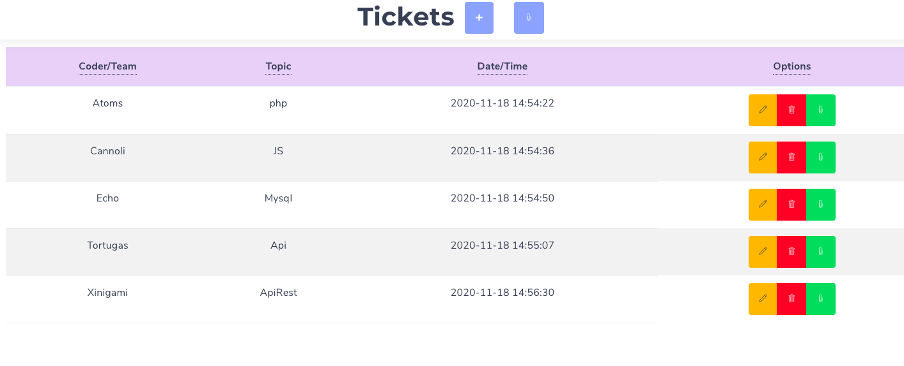
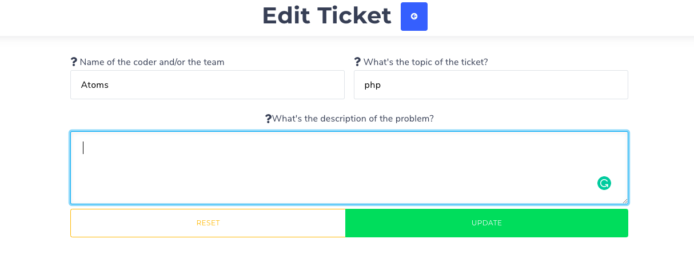
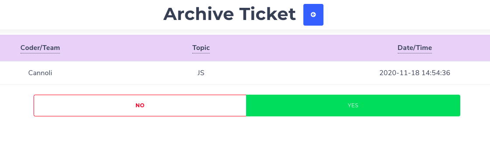
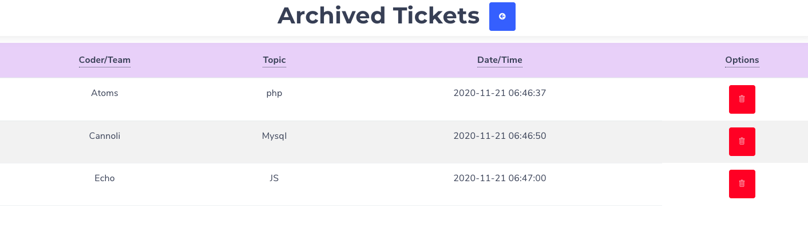

# MVC CRUD

## Requiered

- PHP 7.4
- Composer installed

## Install

`` composer install ``

## Run Tests

`` vendor/bin/phpunit ``

## Install dependencies

`` nmp install ``

## Bootcamp F5 Excercise

### The Clinic

Our company is a development company and we need an application that allows us to request an appointment with the CTO to solve technical problems of the development teams.

At the moment we are going to develop a minimum viable product (MVP). We will start with a spaghetti code, in PHP and try to arrive at an object-oriented application using the MVC pattern (Model, View, Controller).

#### Technical requirements:

    - CRUD type application (Create, Read, Update, Delete)
    - It should be Object Oriented with the MVC pattern
    - A controller to do a CRUD in Ajax. (Api Rest)
    - A logger to be able to audit the operation of the application. You must do a 'log' every time a CRUD action happens
    - Unit Tests from the services to the repositories (decouple from the database)
    - Functionality to mark the appointments already made.
    - Git should be used with good practices in commits.
    - The repository should contain a Readme with an explanation of the project, and an explanation of how to install or run the application.

- Additional features:

    - Make a frontend using the Api
    - Integration test with the Database
    - Bring the application to production

    ### Ticket List (landing page)

    

    ### Edit Ticket

    

    ### Archive Ticket 

    

    ### Archived Ticket List

    

